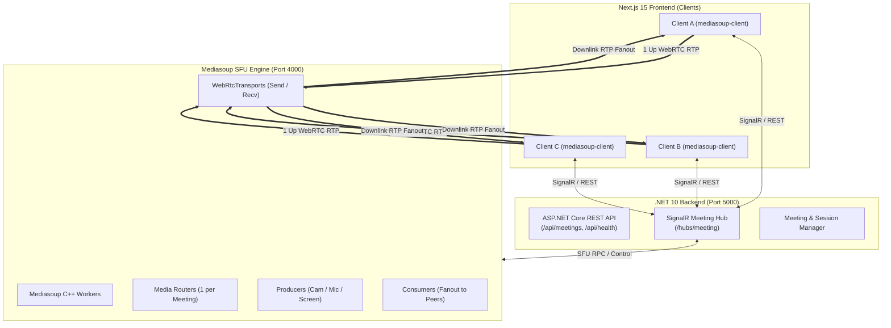

# BMad Technical Architecture: Mediasoup SFU + .NET Backend + Next.js

**Status**: [APPROVED]  
**Architecture Paradigm**: Decoupled Selective Forwarding Unit (SFU) with .NET 10 Orchestration & SignalR Signaling

---

## 1. System Architecture Diagram

---

## 2. Invariants & Architecture Decisions

* **AD-1: SFU over Full-Mesh**
  * **Binds**: Media routing architecture.
  * **Prevents**: Exponential client CPU/upload bandwidth exhaustion with 3+ users.
  * **Rule**: Each client establishes **1 Send Transport** ($O(1)$ video+audio upload) and **1 Recv Transport** ($O(N-1)$ download fanout via Mediasoup SFU).

* **AD-2: .NET 10 for Business Logic & Room Lifecycle**
  * **Binds**: Primary backend stack (`backend/`).
  * **Prevents**: Node.js monolithic bottleneck for business APIs and session state.
  * **Rule**: ASP.NET Core 10 controls room creation, health checks, participant access tokens, and SignalR presence/chat broadcast.

* **AD-3: Mediasoup SFU Service Isolation**
  * **Binds**: Media processing engine (`sfu/`).
  * **Rule**: Dedicated Mediasoup worker processes handle RTP/RTCP packet switching and codec negotiation (VP8, VP9, H264, Opus).

* **AD-4: Modern Next.js 15 Glassmorphic UI/UX**
  * **Binds**: Frontend user interface (`insta-meets/`).
  * **Rule**: Deliver an elevated, premium meeting interface with dynamic speaker spotlight, audio level visualizations, responsive grid layout, floating glass control bar, and polished chat drawer.

---

## 3. Component Breakdown

| Component | Technology | Directory | Responsibility |
| :--- | :--- | :--- | :--- |
| **.NET Backend** | .NET 10, ASP.NET Core, SignalR | `backend/` | REST APIs, meeting lifecycle, SignalR presence & chat |
| **Mediasoup SFU** | Mediasoup v3, Node.js worker pool | `sfu/` | WebRtcTransports, Producers, Consumers, RTP forwarding |
| **Frontend App** | Next.js 15, React 19, `mediasoup-client`, Tailwind CSS | `insta-meets/` | Device management, SFU streams, premium meeting UI/UX |
